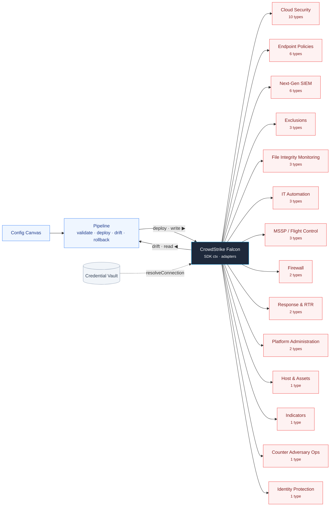

# 🦅 CrowdStrike Falcon — Dataflow

> How configuration flows between the Veltrix platform, this app, and the CrowdStrike Falcon APIs. **Auto-generated** from `manifest.yaml` — do not edit by hand (regenerate via `scripts/dataflow/generate.mjs`).

**App:** `crowdstrike-edr` · **Category:** EDR · **Version:** 1.13.1  
**44 config types** across **14 API families** · 44 deployable · 44 drift-detected · 44 rollback-capable

## Flow

- **Deploy ▶** — the pipeline validates a canvas and writes it to the vendor API (`deploy` handler).
- **Drift ◀** — the app reads live vendor state and reconciles it against the canvas (`driftDetect` handler).
- **Credential Vault** — tenant credentials are resolved per request via `ctx.resolveConnection` — never held by the app.

## Config types by API family

### Cloud Security (10 types)

| Config type | Deploy ▶ | Drift ◀ | Rollback | Status |
|---|:--:|:--:|:--:|:--:|
| Cloud Account Registration Configuration `cloud-account-registrations` | ✅ | ✅ | ✅ | ✅ |
| Cloud Compliance Control Configuration `cloud-compliance-controls` | ✅ | ✅ | ✅ | ✅ |
| Cloud Compliance Framework Configuration `cloud-compliance-frameworks` | ✅ | ✅ | ✅ | ✅ |
| Cloud Group Configuration `cloud-groups` | ✅ | ✅ | ✅ | ✅ |
| Cloud IOM Custom Rule Configuration `cloud-iom-custom-rules` | ✅ | ✅ | ✅ | ✅ |
| Cloud Rule Override Configuration `cloud-rule-overrides` | ✅ | ✅ | ✅ | ✅ |
| Cloud Suppression Rule Configuration `cloud-suppression-rules` | ✅ | ✅ | ✅ | ✅ |
| Image Assessment Policy Configuration `cloud-image-assessment-policies` | ✅ | ✅ | ✅ | ✅ |
| Kubernetes Admission Policy Configuration `cloud-kac-policies` | ✅ | ✅ | ✅ | ✅ |
| Registry Connection Configuration `cloud-registry-connections` | ✅ | ✅ | ✅ | ✅ |

### Endpoint Policies (6 types)

| Config type | Deploy ▶ | Drift ◀ | Rollback | Status |
|---|:--:|:--:|:--:|:--:|
| Content Update Policy Configuration `content-update-policies` | ✅ | ✅ | ✅ | ✅ |
| Custom IOA Rule Group Configuration `custom-ioa-rule-groups` | ✅ | ✅ | ✅ | ✅ |
| Prevention Policy Configuration `prevention-policies` | ✅ | ✅ | ✅ | ✅ |
| Response Policy Configuration `response-policies` | ✅ | ✅ | ✅ | ✅ |
| Sensor Update Policy Configuration `sensor-update-policies` | ✅ | ✅ | ✅ | ✅ |
| USB Device Control Policy Configuration `usb-device-control-policies` | ✅ | ✅ | ✅ | ✅ |

### Next-Gen SIEM (6 types)

| Config type | Deploy ▶ | Drift ◀ | Rollback | Status |
|---|:--:|:--:|:--:|:--:|
| Correlation Rule Configuration `ngsiem-correlation-rules` | ✅ | ✅ | ✅ | ✅ |
| Dashboard Configuration `ngsiem-dashboards` | ✅ | ✅ | ✅ | ✅ |
| Data Connection Configuration `ngsiem-data-connections` | ✅ | ✅ | ✅ | ✅ |
| Lookup File Configuration `ngsiem-lookup-files` | ✅ | ✅ | ✅ | ✅ |
| Parser Configuration `ngsiem-parsers` | ✅ | ✅ | ✅ | ✅ |
| Saved Query Configuration `ngsiem-saved-queries` | ✅ | ✅ | ✅ | ✅ |

### Exclusions (3 types)

| Config type | Deploy ▶ | Drift ◀ | Rollback | Status |
|---|:--:|:--:|:--:|:--:|
| IOA Exclusion Configuration `ioa-exclusions` | ✅ | ✅ | ✅ | ✅ |
| ML Exclusion Configuration `ml-exclusions` | ✅ | ✅ | ✅ | ✅ |
| Sensor Visibility Exclusion Configuration `sv-exclusions` | ✅ | ✅ | ✅ | ✅ |

### File Integrity Monitoring (3 types)

| Config type | Deploy ▶ | Drift ◀ | Rollback | Status |
|---|:--:|:--:|:--:|:--:|
| FileVantage Policy Configuration `filevantage-policies` | ✅ | ✅ | ✅ | ✅ |
| FileVantage Rule Group Configuration `filevantage-rule-groups` | ✅ | ✅ | ✅ | ✅ |
| FileVantage Scheduled Exclusion Configuration `filevantage-scheduled-exclusions` | ✅ | ✅ | ✅ | ✅ |

### IT Automation (3 types)

| Config type | Deploy ▶ | Drift ◀ | Rollback | Status |
|---|:--:|:--:|:--:|:--:|
| IT Automation Policy Configuration `it-automation-policies` | ✅ | ✅ | ✅ | ✅ |
| IT Automation Scheduled Task Configuration `it-automation-scheduled-tasks` | ✅ | ✅ | ✅ | ✅ |
| IT Automation Task Configuration `it-automation-tasks` | ✅ | ✅ | ✅ | ✅ |

### MSSP / Flight Control (3 types)

| Config type | Deploy ▶ | Drift ◀ | Rollback | Status |
|---|:--:|:--:|:--:|:--:|
| MSSP CID Group Configuration `mssp-cid-groups` | ✅ | ✅ | ✅ | ✅ |
| MSSP Role Mapping Configuration `mssp-role-mappings` | ✅ | ✅ | ✅ | ✅ |
| MSSP User Group Configuration `mssp-user-groups` | ✅ | ✅ | ✅ | ✅ |

### Firewall (2 types)

| Config type | Deploy ▶ | Drift ◀ | Rollback | Status |
|---|:--:|:--:|:--:|:--:|
| Firewall Policy Configuration `firewall-policies` | ✅ | ✅ | ✅ | ✅ |
| Firewall Rule Group Configuration `firewall-rule-groups` | ✅ | ✅ | ✅ | ✅ |

### Response & RTR (2 types)

| Config type | Deploy ▶ | Drift ◀ | Rollback | Status |
|---|:--:|:--:|:--:|:--:|
| RTR Custom Script Configuration `rtr-response-scripts` | ✅ | ✅ | ✅ | ✅ |
| RTR Put-File Configuration `rtr-put-files` | ✅ | ✅ | ✅ | ✅ |

### Platform Administration (2 types)

| Config type | Deploy ▶ | Drift ◀ | Rollback | Status |
|---|:--:|:--:|:--:|:--:|
| Installation Token Configuration `installation-tokens` | ✅ | ✅ | ✅ | ✅ |
| User Configuration `users` | ✅ | ✅ | ✅ | ✅ |

### Host & Assets (1 type)

| Config type | Deploy ▶ | Drift ◀ | Rollback | Status |
|---|:--:|:--:|:--:|:--:|
| Host Group Configuration `host-groups` | ✅ | ✅ | ✅ | ✅ |

### Indicators (1 type)

| Config type | Deploy ▶ | Drift ◀ | Rollback | Status |
|---|:--:|:--:|:--:|:--:|
| Custom IOC Configuration `custom-iocs` | ✅ | ✅ | ✅ | ✅ |

### Counter Adversary Ops (1 type)

| Config type | Deploy ▶ | Drift ◀ | Rollback | Status |
|---|:--:|:--:|:--:|:--:|
| Recon Monitoring Rule Configuration `recon-monitoring-rules` | ✅ | ✅ | ✅ | ✅ |

### Identity Protection (1 type)

| Config type | Deploy ▶ | Drift ◀ | Rollback | Status |
|---|:--:|:--:|:--:|:--:|
| Identity Protection Policy Rule Configuration `idp-policy-rules` | ✅ | ✅ | ✅ | ✅ |

---

Generated by `scripts/dataflow/generate.mjs`. Legend: ✅ handler present · — not applicable.
