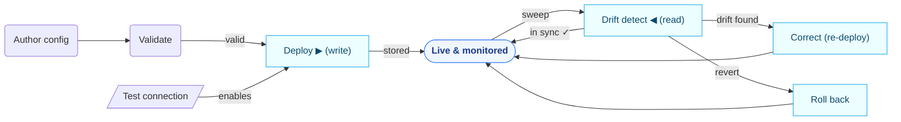
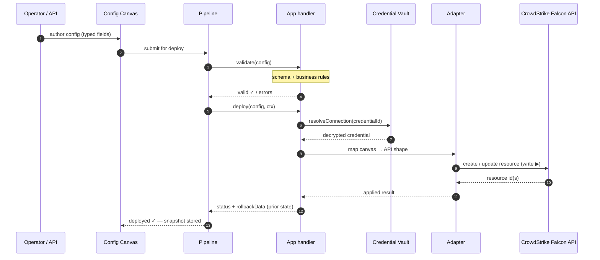
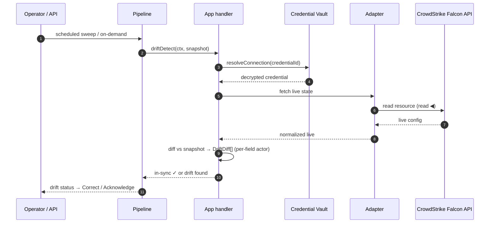
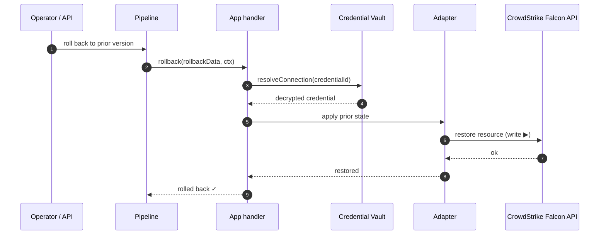
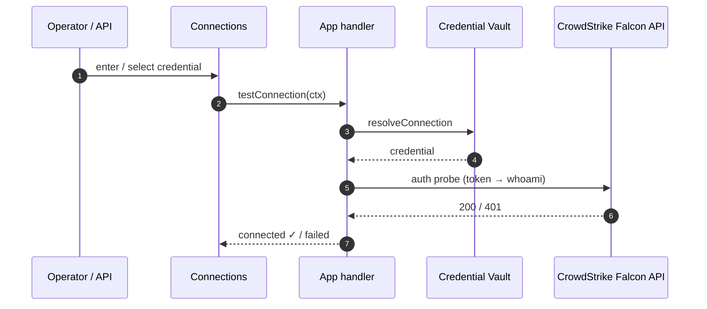

# 🦅 CrowdStrike Falcon — Request Flows

> How a request is routed through the system — from the moment you act to when it reaches completion. **Auto-generated** from `manifest.yaml` (regenerate via `scripts/dataflow/generate.mjs`).

**App:** `crowdstrike-edr` · **Category:** EDR · **Version:** 1.13.1  
**Operations:** Deploy a configuration · Detect drift · Roll back · Test connection  
Talks to **CrowdStrike Falcon API** · credentials via the Credential Vault (`ctx.resolveConnection`).

## Lifecycle — how operations connect

Where a config goes from authoring to steady state, and how each request type feeds the next.

## Request flows — how each one reaches completion

### Deploy a configuration

*You publish or change a config (e.g. a policy, rule, or exclusion).*  
Applies to: 44 config types · 14 API families.

### Detect drift

*A scheduled sweep or on-demand check reconciles live state against the canvas.*  
Applies to: 44 config types · 14 API families.

### Roll back

*Revert a config to its previously-deployed state using the stored rollbackData.*  
Applies to: 44 config types · 14 API families.

### Test connection

*Verify a tenant credential before any deploy or drift can run.*  
Applies to: precondition for every operation.

---

Generated by `scripts/dataflow/generate.mjs`. Solid arrow = call ▶ · dashed = return ◀.
